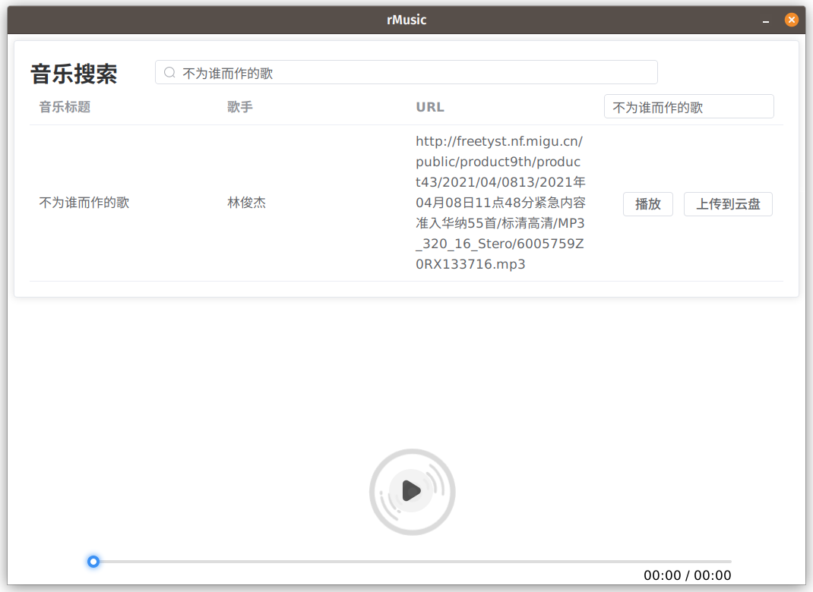

<h1 align="center">rMusic</h1>

使用 <a href="https://tauri.app">Tauri</a> 实现的音乐搜索播放软件，支持 Linux、Windows、MacOS。

## 🚀 下载渠道
- [GitHub Releases](https://github.com/EnableAsync/rMusic/releases)

## ✨ 功能
- [x] 基于 [UnblockNeteaseMusic/server-rust](https://github.com/UnblockNeteaseMusic/server-rust) 实现解析音乐下载链接
- [x] 基于 [Tauri](https://tauri.app) 实现音乐在线播放
- [ ] 上传音乐至云盘

## 📄 感谢以下开源项目
- [UnblockNeteaseMusic](https://github.com/UnblockNeteaseMusic/server-rust)
- [vue3-audio-player](https://github.com/RealCoolSnow/vue3-audio-player)

## ⚠️ 免责声明

本程序仅供个人学习及研究 Rust Tauri 使用，并未用于盈利用途。

若您认为本程序侵犯了您的知识产权，请提出 PR、Issue 或 DMCA 请求，表达您想移除相关代码意愿。
